# Task Dependency Graph

Generated from `tasks/{active,completed,archived}/*/manifest.yaml`. Archived initiatives are omitted.

```mermaid
flowchart TD
  QW-002["QW-002: Versioned ML Pipeline Profiles"]
  QW-003["QW-003: Book-Guided Self-Play Runner"]
  QW-004["QW-004: Opening Probe Contract and Runtime"]
  QW-005["QW-005: Search and H2H Active-Learning Feedback Loop"]
  QW-006["QW-006: Search-Derived Observation Policy Targets"]
  QW-007["QW-007: Checkpoint Consumer Compatibility"]
  QW-009["QW-009: Public Play Deployment — Storeless Docker"]
  QW-010["QW-010: Play UX for Non-Expert Players — Skill Levels and How-to-Play"]
  QW-011["QW-011: Puzzle Mode in the Browser"]
  QW-015["QW-015: Release-Engineering Hardening"]
  QW-016["QW-016: Season Two Article Publication"]
  QW-017["QW-017: ONNX Model Serving in the Rust API"]
  QW-018["QW-018: Engine Response Type — Candidates, PV, Certainty"]
  QW-019["QW-019: Register the Phantom Engine API Contracts"]
  QW-020["QW-020: Container Distribution for the Rust API"]
  QW-021["QW-021: Opening Coverage Expansion — Plies 0 to 6"]
  QW-022["QW-022: Workspace Repo Hygiene — Remaining Items"]
  QW-023["QW-023: Settle the Corpus Axis at Converged Budget"]
  QW-024["QW-024: The Opening Arena — Measuring From Ply 0"]
  QW-026["QW-026: Re-run the Patience-Lineup Arena on an Independent Seed"]
  QW-027["QW-027: Corpus Label Structure and the Shallow-Ply Floor"]
  QW-028["QW-028: Finish the Opening Book Solve"]
  QW-029["QW-029: Shallow-Ply Scoring as a Standing Metric"]
  QW-001["QW-001: Canonical Game State and Action Encoding Contract"]
  QW-008["QW-008: Local Play Service — Analysis and Recording"]
  QW-012["QW-012: Re-run the Architecture Lineup Under --patience"]
  QW-013["QW-013: Play-Store Solver-Queue Export"]
  QW-014["QW-014: Training Program — Architecture Lineup, Learning-Rate Correction, and the v3 Corpus Result"]
  QW-025["QW-025: Publish the dev-data dataset repos"]
  QW-030["QW-030: The Playground — One-Port Monolith and Non-Expert Play UX"]
  QW-001 --> QW-003
  QW-001 --> QW-004
  QW-002 --> QW-005
  QW-003 --> QW-005
  QW-004 --> QW-005
  QW-006 --> QW-005
  QW-007 --> QW-005
  QW-001 --> QW-006
  QW-001 --> QW-007
  QW-008 --> QW-009
  QW-008 --> QW-010
  QW-012 --> QW-010
  QW-024 --> QW-010
  QW-008 --> QW-011
  QW-015 --> QW-016
  QW-019 --> QW-017
  QW-019 --> QW-018
  QW-017 --> QW-020
  QW-012 --> QW-021
  QW-012 --> QW-023
  QW-012 --> QW-026
  QW-021 --> QW-028
  QW-014 --> QW-012
  QW-008 --> QW-013
  QW-008 --> QW-030
  class QW-002 ready
  class QW-003 ready
  class QW-004 ready
  class QW-005 blocked
  class QW-006 ready
  class QW-007 ready
  class QW-009 ready
  class QW-010 blocked
  class QW-011 ready
  class QW-015 ready
  class QW-016 blocked
  class QW-017 blocked
  class QW-018 blocked
  class QW-019 ready
  class QW-020 blocked
  class QW-021 ready
  class QW-022 ready
  class QW-023 ready
  class QW-024 ready
  class QW-026 ready
  class QW-027 ready
  class QW-028 blocked
  class QW-029 ready
  class QW-001 done
  class QW-008 done
  class QW-012 done
  class QW-013 done
  class QW-014 done
  class QW-025 done
  class QW-030 done
  classDef done fill:#d3f9d8,stroke:#2b8a3e,color:#1b1b1b
  classDef blocked fill:#ffe3e3,stroke:#c92a2a,color:#1b1b1b
  classDef ready fill:#e7f5ff,stroke:#1971c2,color:#1b1b1b
```

`done`: filed under `completed/`, or every active work item is `status: completed`. `blocked`: at least one `dependencies` entry is not yet done. `ready`: unblocked, dispatchable now.

| ID | State | Complexity | Repos | Depends on | Blocked by | Title |
| --- | --- | --- | --- | --- | --- | --- |
| `QW-002` | ready | M | `quantik-models-py` | - | - | Versioned ML Pipeline Profiles |
| `QW-003` | ready | XL | `quantik-core-contracts`, `quantik-core-rust`, `quantik-models-py` | QW-001 | - | Book-Guided Self-Play Runner |
| `QW-004` | ready | L | `quantik-core-contracts`, `quantik-core-rust` | QW-001 | - | Opening Probe Contract and Runtime |
| `QW-005` | blocked | XL | `quantik-core-contracts`, `quantik-core-rust`, `quantik-models-py` | QW-002, QW-003, QW-004, QW-006, QW-007 | QW-002, QW-003, QW-004, QW-006, QW-007 | Search and H2H Active-Learning Feedback Loop |
| `QW-006` | ready | L | `quantik-core-rust`, `quantik-models-py` | QW-001 | - | Search-Derived Observation Policy Targets |
| `QW-007` | ready | XL | `quantik-core-contracts`, `quantik-core-py`, `quantik-core-rust`, `quantik-models-py` | QW-001 | - | Checkpoint Consumer Compatibility |
| `QW-009` | ready | M | `quantik-models-py` | QW-008 | - | Public Play Deployment — Storeless Docker |
| `QW-010` | blocked | M | `quantik-models-py` | QW-008, QW-012, QW-024 | QW-024 | Play UX for Non-Expert Players — Skill Levels and How-to-Play |
| `QW-011` | ready | S | `quantik-models-py` | QW-008 | - | Puzzle Mode in the Browser |
| `QW-015` | ready | S | `quantik-core-contracts`, `quantik-core-rust`, `quantik-core-py` | - | - | Release-Engineering Hardening |
| `QW-016` | blocked | M | `articles` | QW-015 | QW-015 | Season Two Article Publication |
| `QW-017` | blocked | XL | `quantik-api-rust`, `quantik-models-py` | QW-019 | QW-019 | ONNX Model Serving in the Rust API |
| `QW-018` | blocked | L | `quantik-api-rust`, `quantik-core-contracts` | QW-019 | QW-019 | Engine Response Type — Candidates, PV, Certainty |
| `QW-019` | ready | L | `quantik-core-contracts`, `quantik-api-rust`, `quantik-qfen-visualizer`, `quantik-models-py` | - | - | Register the Phantom Engine API Contracts |
| `QW-020` | blocked | M | `quantik-api-rust` | QW-017 | QW-017 | Container Distribution for the Rust API |
| `QW-021` | ready | XL | `quantik-models-py` | QW-012 | - | Opening Coverage Expansion — Plies 0 to 6 |
| `QW-022` | ready | S | `quantik-models-py`, `articles` | - | - | Workspace Repo Hygiene — Remaining Items |
| `QW-023` | ready | M | `quantik-models-py` | QW-012 | - | Settle the Corpus Axis at Converged Budget |
| `QW-024` | ready | M | `quantik-models-py` | - | - | The Opening Arena — Measuring From Ply 0 |
| `QW-026` | ready | S | `quantik-models-py` | QW-012 | - | Re-run the Patience-Lineup Arena on an Independent Seed |
| `QW-027` | ready | L | `quantik-models-py` | - | - | Corpus Label Structure and the Shallow-Ply Floor |
| `QW-028` | blocked | M | `quantik-models-py` | QW-021 | QW-021 | Finish the Opening Book Solve |
| `QW-029` | ready | XL | `quantik-models-py` | - | - | Shallow-Ply Scoring as a Standing Metric |
| `QW-001` | done | - | `quantik-core-contracts`, `quantik-core-py`, `quantik-core-rust`, `quantik-models-py` | - | - | Canonical Game State and Action Encoding Contract |
| `QW-008` | done | - | `quantik-models-py` | - | - | Local Play Service — Analysis and Recording |
| `QW-012` | done | - | `quantik-models-py` | QW-014 | - | Re-run the Architecture Lineup Under --patience |
| `QW-013` | done | - | `quantik-models-py` | QW-008 | - | Play-Store Solver-Queue Export |
| `QW-014` | done | - | `quantik-models-py` | - | - | Training Program — Architecture Lineup, Learning-Rate Correction, and the v3 Corpus Result |
| `QW-025` | done | - | `quantik-models-py` | - | - | Publish the dev-data dataset repos |
| `QW-030` | done | - | `quantik-models-py`, `quantik-qfen-visualizer` | QW-008 | - | The Playground — One-Port Monolith and Non-Expert Play UX |
